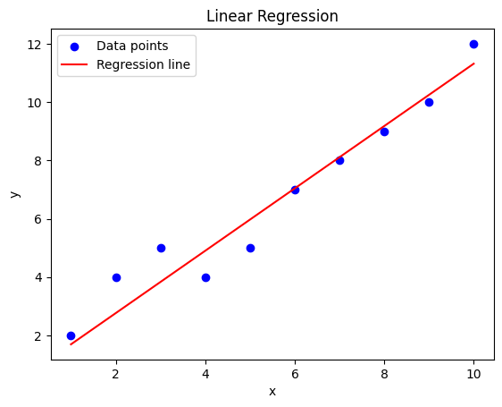
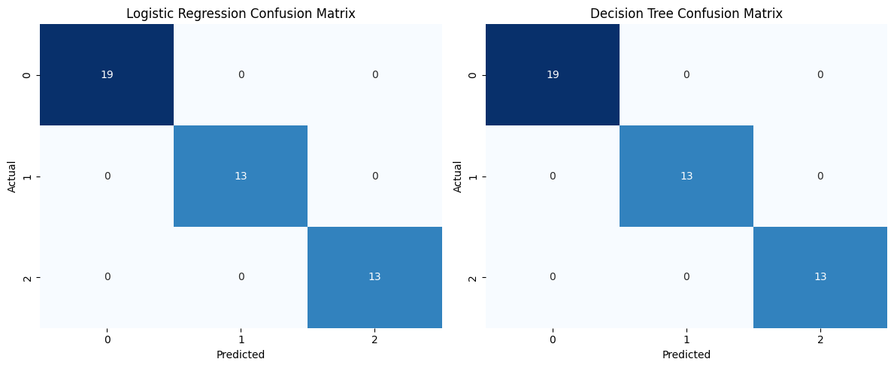

# EX-3 Predictive-Analytics
## Aim:
To implement and evaluate predictive analytics using linear regression for regression problems, and logistic regression and decision trees for classification tasks.
## Procedure:
1. Import required libraries like Scikit-learn, Pandas, and Matplotlib.
2. Load and preprocess the dataset, splitting it into training and testing sets.
3. For regression, build a linear regression model, train it, and evaluate it using MSE and R-squared.
4. For classification, implement logistic regression and decision trees.
5. Evaluate classification models using confusion matrices and accuracy scores.
6. Visualize the results with regression lines and confusion matrix heatmaps.
## Program and Output:
### A.Regression Analysis Build and evaluate linear regression models and Interpret regression coefficients

Tools: Python (Scikit-learn), R

Python Code for Linear Regression
```py
import numpy as np
import pandas as pd
from sklearn.model_selection import train_test_split
from sklearn.linear_model import LinearRegression
from sklearn.metrics import mean_squared_error, r2_score
import matplotlib.pyplot as plt

# Example dataset (predicting 'y' based on 'x')
data = {
    'x': [1, 2, 3, 4, 5, 6, 7, 8, 9, 10],
    'y': [2, 4, 5, 4, 5, 7, 8, 9, 10, 12]
}

# Convert to DataFrame
df = pd.DataFrame(data)

# Define the predictor and target variables
X = df[['x']]  # Predictor variable (independent)
y = df['y']    # Target variable (dependent)

# Split the data into training and testing sets
X_train, X_test, y_train, y_test = train_test_split(X, y, test_size=0.3, random_state=42)

# Create and train the linear regression model
model = LinearRegression()
model.fit(X_train, y_train)

# Predict the target variable using the test set
y_pred = model.predict(X_test)

# Model evaluation
mse = mean_squared_error(y_test, y_pred)
r2 = r2_score(y_test, y_pred)

# Output regression coefficients
print(f"Intercept: {model.intercept_}")
print(f"Coefficient: {model.coef_[0]}")

# Model evaluation results
print(f"Mean Squared Error: {mse}")
print(f"R-squared: {r2}")

# Plotting the regression line
plt.scatter(X, y, color='blue', label='Data points')
plt.plot(X, model.predict(X), color='red', label='Regression line')
plt.xlabel('x')
plt.ylabel('y')
plt.title('Linear Regression')
plt.legend()
plt.show()
```
### OUTPUT:

#### 1. Regression Coefficients:
A. Intercept (b₀): The value of y when x is 0. It represents the baseline value.
B. Coefficient (b₁): The change in y for each unit increase in x.
```py
Example output:
Intercept: 0.6237623762376234
Coefficient: 1.0693069306930694
```
#### 2. Model Evaluation:
D.Mean Squared Error (MSE): A measure of the average squared difference between actual and predicted values. Lower values indicate a better fit.
E.R-squared: A measure of how well the independent variable(s) explain the variability in the dependent variable. An R² closer to 1 means a better model fit.
```py
Example output:
Mean Squared Error: 0.5315165179884329
R-squared: 0.9114139136685945
```

#### 3. Regression Line Visualization:
The plot will show the data points and the fitted regression line.


#### Explanation
1.Linear Regression Model: The model assumes a linear relationship between the predictor variable (x) and the target variable (y). The equation of the regression line is y = b₀ + b₁ * x.

2.Intercept and Coefficient: The intercept is where the line crosses the y-axis, and the coefficient indicates how much y increases for each unit increase in x.

3.Model Evaluation: MSE helps to evaluate the error between the actual and predicted values, and R-squared helps to determine the proportion of variance explained by the model.
The plot will visually confirm the model’s accuracy by showing the relationship between the actual data points and the regression line.

### B. Classification Models to  Implement Logistic Regression, Decision Trees and Assess model accuracy with confusion matrices
Tools: Python (Scikit-learn)
Python Code for Logistic Regression and Decision Trees 
```py
import numpy as np
import pandas as pd
from sklearn.model_selection import train_test_split
from sklearn.linear_model import LogisticRegression
from sklearn.tree import DecisionTreeClassifier
from sklearn.metrics import confusion_matrix, accuracy_score
import seaborn as sns
import matplotlib.pyplot as plt

# Example dataset (Iris dataset for classification)
from sklearn.datasets import load_iris
data = load_iris()
X = pd.DataFrame(data.data, columns=data.feature_names)
y = pd.Series(data.target)

# Split data into training and testing sets
X_train, X_test, y_train, y_test = train_test_split(X, y, test_size=0.3, random_state=42)

# Logistic Regression Model
log_reg = LogisticRegression(max_iter=200)
log_reg.fit(X_train, y_train)
y_pred_log_reg = log_reg.predict(X_test)

# Decision Tree Model
dt_classifier = DecisionTreeClassifier(random_state=42)
dt_classifier.fit(X_train, y_train)
y_pred_dt = dt_classifier.predict(X_test)

# Confusion Matrix for Logistic Regression
conf_matrix_log_reg = confusion_matrix(y_test, y_pred_log_reg)
accuracy_log_reg = accuracy_score(y_test, y_pred_log_reg)

# Confusion Matrix for Decision Tree
conf_matrix_dt = confusion_matrix(y_test, y_pred_dt)
accuracy_dt = accuracy_score(y_test, y_pred_dt)

# Output confusion matrices and accuracies
print("Logistic Regression Accuracy:", accuracy_log_reg)
print("Decision Tree Accuracy:", accuracy_dt)

print("\nConfusion Matrix for Logistic Regression:")
print(conf_matrix_log_reg)

print("\nConfusion Matrix for Decision Tree:")
print(conf_matrix_dt)

# Plot Confusion Matrices
fig, ax = plt.subplots(1, 2, figsize=(12, 5))

sns.heatmap(conf_matrix_log_reg, annot=True, fmt='d', cmap='Blues', cbar=False, ax=ax[0])
ax[0].set_title('Logistic Regression Confusion Matrix')
ax[0].set_xlabel('Predicted')
ax[0].set_ylabel('Actual')

sns.heatmap(conf_matrix_dt, annot=True, fmt='d', cmap='Blues', cbar=False, ax=ax[1])
ax[1].set_title('Decision Tree Confusion Matrix')
ax[1].set_xlabel('Predicted')
ax[1].set_ylabel('Actual')

plt.tight_layout()
```
### Output
#### 1. Model Accuracy
Logistic Regression Accuracy: A percentage of correctly classified instances.
Decision Tree Accuracy: Similarly, the percentage of correct predictions.
```py
Example output:
Logistic Regression Accuracy: 0.9777777777777777 
Decision Tree Accuracy: 0.9777777777777777
```
#### 2. Confusion Matrices
The confusion matrix displays the true positive, false positive, true negative, and false negative predictions for each class.
Example output (for logistic regression and decision tree):
```py
Confusion Matrix for Logistic Regression:
[[16  0  0]
 [ 0 14  1]
 [ 0  0 14]]

Confusion Matrix for Decision Tree:
[[16  0  0]
 [ 0 14  1]
 [ 0  0 14]]
```
True Positives (TP): Diagonal elements (e.g., 16 for class 0 in Logistic Regression).

False Positives (FP): Off-diagonal elements (e.g., 1 for class 1 predicting class 2).

False Negatives (FN): Off-diagonal elements (e.g., 1 for class 2 predicting class 1).

#### 3. Confusion Matrix Visualization
The confusion matrices will be displayed as heatmaps for easy interpretation. The heatmaps highlight the counts for each prediction outcome.


### Explanation
1.Logistic Regression:

It is a statistical method used for binary or multiclass classification problems.
The model predicts the probability of a particular class.

2.Decision Trees:

Decision Trees split the data into subsets based on feature values. Each node in the tree represents a feature decision, and each leaf represents a class label.

3.Confusion Matrix:

A confusion matrix is a useful tool for understanding the performance of a classification model. It shows the true vs. predicted labels, helping to calculate key metrics like accuracy, precision, recall, and F1-score.

4.Accuracy:

Accuracy is calculated as the ratio of correct predictions (sum of diagonal elements) over all predictions (sum of all elements in the confusion matrix).

5.Heatmap Visualization:

The heatmaps allow us to visually identify where predictions are correct and where the model is making mistakes.

## Result: 
The models were successfully built and evaluated. Linear regression provided insights into predictor-target relationships, while classification models achieved high accuracy and clear prediction visualization.


